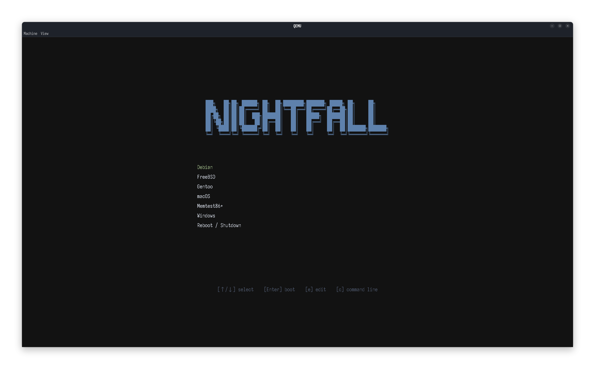

We list the simple steps to take in making a custom `grub` theme populated with ANSI arts. At the end, we create a custom `grub` theme as below:



## Tools

- `grub`: obviously.
- `grub2-theme-preview`: preview themes.
- ANSI Art Generator: [https://patorjk.com/software/taag/](https://patorjk.com/software/taag/)
- Fonts: some `.ttf` fonts of your choice

## Fonts

For `grub`, we first convert any `.ttf` fonts to `.pf2`.

```sh
grub-mkfont -s 14 -o ~/Iosevka-Nerd-Font-Propo-14.pf2 /usr/share/fonts/TTF/IosevkaNerdFontPropo-Regular.ttf
```

We therefore convert the `.ttf` font at `/usr/share/fonts/TTF/IosevkaNerdFontPropo-Regular.ttf` into a `.pf2` file under `~/Iosevka-Nerd-Font-Propo-14.pf2` at font size `14`. The internal name for this font should be `Iosevka Nerd Font Propo 14`. We repeat this process to build any combination of fonts needed.

## ANSI Art

We generate the ANSI arts with the generator. An example text output shows:

```txt
███╗   ██╗██╗ ██████╗ ██╗  ██╗████████╗███████╗ █████╗ ██╗     ██╗     
████╗  ██║██║██╔════╝ ██║  ██║╚══██╔══╝██╔════╝██╔══██╗██║     ██║     
██╔██╗ ██║██║██║  ███╗███████║   ██║   █████╗  ███████║██║     ██║     
██║╚██╗██║██║██║   ██║██╔══██║   ██║   ██╔══╝  ██╔══██║██║     ██║     
██║ ╚████║██║╚██████╔╝██║  ██║   ██║   ██║     ██║  ██║███████╗███████╗
╚═╝  ╚═══╝╚═╝ ╚═════╝ ╚═╝  ╚═╝   ╚═╝   ╚═╝     ╚═╝  ╚═╝╚══════╝╚══════╝
```

In the actual `grub` theme file, this is best loaded as a series of labels with hardcoded alignment.

## Theme Template

We now build a `theme.txt` file to specify the `grub` theme. An example theme at `/boot/grub/themes/lazygrub` is shown below:

```txt
# GRUB2 Theme: Text-Based Nord Dark/Midnight themes
# ---------------------------------------------------------

# Global properties
title-text: ""
desktop-color: "#121212" # nn 0

# ---------------------------------------------------------
# ASCII Art Header
# ---------------------------------------------------------
+ label {
    top = 20%
    left = 30%
    width = 40%
    text = "███╗   ██╗██╗ ██████╗ ██╗  ██╗████████╗███████╗ █████╗ ██╗     ██╗     "
    font = "Iosevka Nerd Font Propo 24"
    color = "#5e81ac" # nord 10
    align = "center"
}
+ label {
    top = 22%
    left = 30%
    width = 40%
    text = "████╗  ██║██║██╔════╝ ██║  ██║╚══██╔══╝██╔════╝██╔══██╗██║     ██║     "
    font = "Iosevka Nerd Font Propo 24"
    color = "#5e81ac"
    align = "center"
}
+ label {
    top = 24%
    left = 30%
    width = 40%
    text = "██╔██╗ ██║██║██║  ███╗███████║   ██║   █████╗  ███████║██║     ██║     "
    font = "Iosevka Nerd Font Propo 24"
    color = "#5e81ac"
    align = "center"
}
+ label {
    top = 26%
    left = 30%
    width = 40%
    text = "██║╚██╗██║██║██║   ██║██╔══██║   ██║   ██╔══╝  ██╔══██║██║     ██║     "
    font = "Iosevka Nerd Font Propo 24"
    color = "#5e81ac"
    align = "center"
}
+ label {
    top = 28%
    left = 30%
    width = 40%
    text = "██║ ╚████║██║╚██████╔╝██║  ██║   ██║   ██║     ██║  ██║███████╗███████╗"
    font = "Iosevka Nerd Font Propo 24"
    color = "#5e81ac"
    align = "center"
}
+ label {
    top = 30%
    left = 30%
    width = 40%
    text = "╚═╝  ╚═══╝╚═╝ ╚═════╝ ╚═╝  ╚═╝   ╚═╝   ╚═╝     ╚═╝  ╚═╝╚══════╝╚══════╝"
    font = "Iosevka Nerd Font Propo 24"
    color = "#5e81ac"
    align = "center"
}

# ---------------------------------------------------------
# Boot Menu Container
# ---------------------------------------------------------
+ boot_menu {
    left = 30%
    top = 40%
    width = 40%
    height = 30%
    item_font = "Iosevka Nerd Font Propo 20"
    item_color = "#D8DEE9"
    item_height = 40
    item_padding = 10
    item_spacing = 5
    item_align = "center"

    selected_item_color = "#A3BE8C"
    selected_item_bg_color = "#3B4252"

    menu_pixmap_style = "none"
    scrollbar = "false"
}

# ---------------------------------------------------------
# Bottom Information Label
# ---------------------------------------------------------
+ label {
    id = "__info_label__"
    text = "[↑/↓] select    [Enter] boot    [e] edit    [c] command line"
    font = "Iosevka Nerd Font Propo 14"
    color = "#4c566a" # nord3
    align = "center"
    left = 10%
    top = 80%
    width = 80%
}
```

## Theme Preview

We preview this theme with `grub2-theme-preview` at 1440p resolution:

```sh
grub2-theme-preview --resolution 2560x1440 /boot/grub/themes/lazygrub/
```

## Apply Changes

We now add the following line to `grub`. Let us simply edit it with `nvim`:

```sh
sudo nvim /etc/default/grub
```

We find `GRUB_THEME=` and update the values. For example:

```txt
GRUB_THEME='/boot/grub/themes/lazygrub/theme.txt'
```

Lastly, we apply the changes to `grub`. For example:

```sh
sudo grub-mkconfig -o /boot/grub/grub.cfg
```

Enjoy the new theme!
